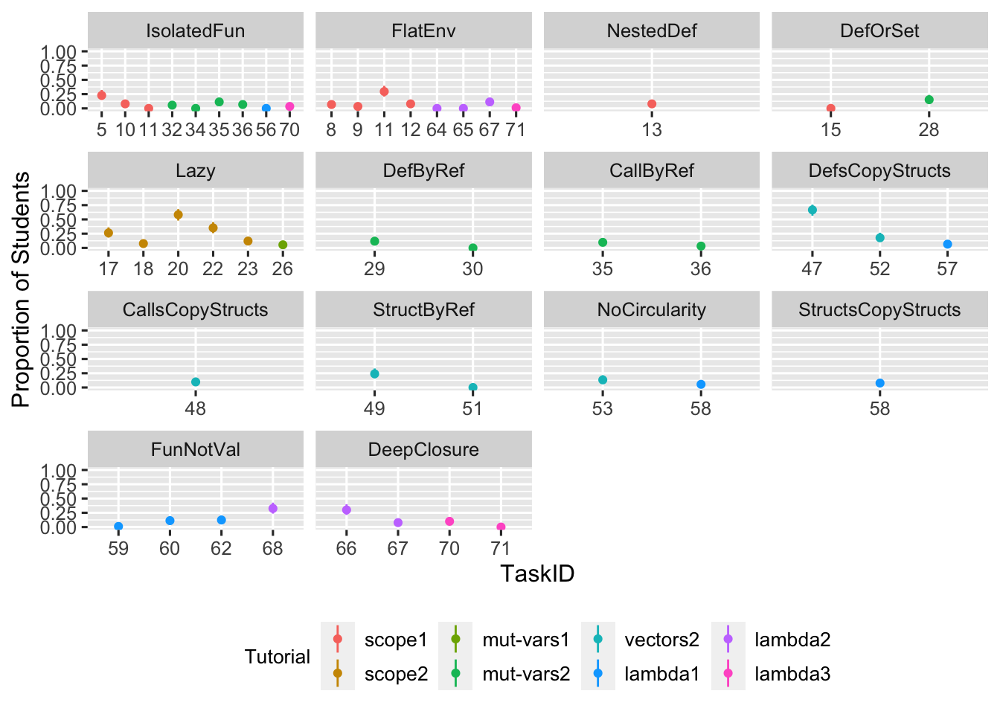
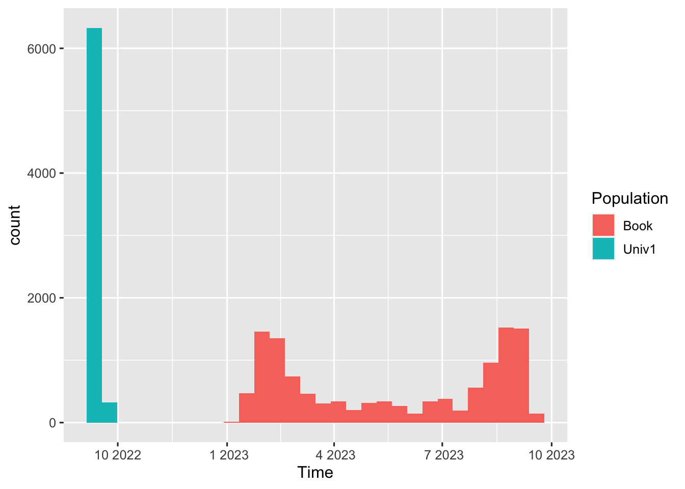
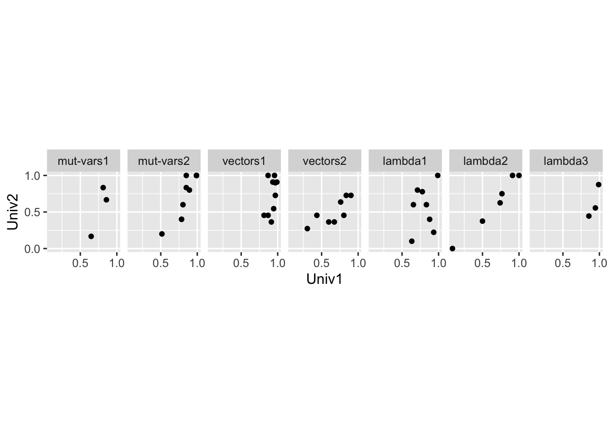
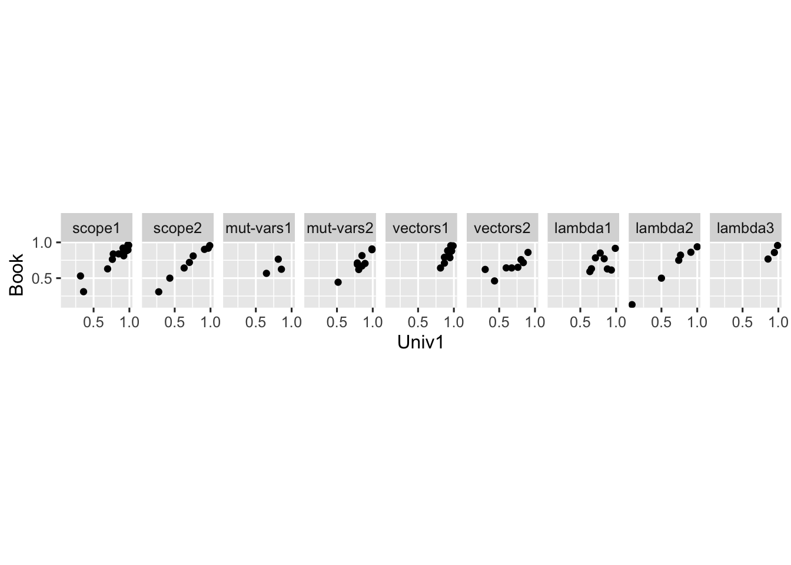

<meta name="date" content="2024-03-02" />

<title>Paper.Rmd</title>

<meta name="viewport" content="width=device-width, initial-scale=1" />
<link rel="stylesheet" href="https://cdn.jsdelivr.net/npm/bootstrap@3.3.7/dist/css/bootstrap.min.css" integrity="sha384-BVYiiSIFeK1dGmJRAkycuHAHRg32OmUcww7on3RYdg4Va+PmSTsz/K68vbdEjh4u" crossorigin="anonymous">

<!-- tabsets -->

<!-- code folding -->

</head>

<body>

<h1 class="title toc-ignore">Paper.Rmd</h1>
<h4 class="date">2024-03-02</h4>

- [About this file](#about-this-file)
  - [include libraries](#include-libraries)
  - [load tasks information](#load-tasks-information)
  - [load wrong answers tagged with misinterpreters](#load-wrong-answers-tagged-with-misinterpreters)
  - [load the dataset](#load-the-dataset)
  - [define helper functions](#define-helper-functions)
- [Section 5.3: The SMoL Quizzes](#section-5.3-the-smol-quizzes)
  - [“Some questions and student answers from Quiz” (Tables 2-4)](#some-questions-and-student-answers-from-quiz-tables-2-4)
- [Section 6.1: The User Experience](#section-6.1-the-user-experience)
  - [“in practice, students spent about 9.8 (median) minutes.”](#in-practice-students-spent-about-9.8-median-minutes.)
- [Section 6.2: Collating Problems for the Tutor](#section-6.2-collating-problems-for-the-tutor)
  - [“Starting with the 37 programs in the SMoL Quizzes”](#starting-with-the-37-programs-in-the-smol-quizzes)
  - [“we added 52 more programs to arrive at a total of 89.”](#we-added-52-more-programs-to-arrive-at-a-total-of-89.)
  - [“The SMoL Quizzes often have very few wrong choices: …”](#the-smol-quizzes-often-have-very-few-wrong-choices)
  - [“we ended up increasing the number of choices substantially: …”](#we-ended-up-increasing-the-number-of-choices-substantially)
- [Section 7.2: A Catalog of Misconceptions](#section-7.2-a-catalog-of-misconceptions)
  - [“we found a gap between 23% and 13%, and hence took 14% as the threshold”](#we-found-a-gap-between-23-and-13-and-hence-took-14-as-the-threshold)
  - [“misconceptions identified by the SMoL Tutor” (Tables 6-8)](#misconceptions-identified-by-the-smol-tutor-tables-6-8)
- [Section 8: Is The Tutor Effective?](#section-8-is-the-tutor-effective)
  - [“How many students chose a wrong answer that (uniquely) represents a misconception?” (Figure 4)](#how-many-students-chose-a-wrong-answer-that-uniquely-represents-a-misconception-figure-4)
  - [“We also perform a logistic regression to see whether these improvements are significant”](#we-also-perform-a-logistic-regression-to-see-whether-these-improvements-are-significant)
  - [“only 40 of the 71 eligible problems (after removing the non-SMoL modules) were useful”](#only-40-of-the-71-eligible-problems-after-removing-the-non-smol-modules-were-useful)
- [Section 9: Performance on Other Populations](#section-9-performance-on-other-populations)
  - [“The Tutor was used in one course …, taken by 12 students”](#the-tutor-was-used-in-one-course-taken-by-12-students)
  - [“597 people started with the first module and 103 users made it to the last one.”](#people-started-with-the-first-module-and-103-users-made-it-to-the-last-one.)
  - [“we note that there is no overlap between the dates of submission on the public instance and the semester at University 1”](#we-note-that-there-is-no-overlap-between-the-dates-of-submission-on-the-public-instance-and-the-semester-at-university-1)
  - [“we computed a Spearman’s rank correlation ρ”](#we-computed-a-spearmans-rank-correlation-ρ)
    - [“Between the original university and University 2”](#between-the-original-university-and-university-2)
    - [“Between the original university and the online population”](#between-the-original-university-and-the-online-population)
- [Section 11: Threats to Validity](#section-11-threats-to-validity)
  - [“on average only 0.4% (sd = 0.6%) of values are missing”](#on-average-only-0.4-sd-0.6-of-values-are-missing)

# About this file

This file presents all important statistics in the paper. When
applicable, it also presents a R program that computes the statistics.
Section headers that are in quotes are quotes from the paper. Those
sections provide evidences for the quoted words.

## include libraries

<pre class="r"><code>library(tidyverse)</code></pre>

## load tasks information

<pre class="r"><code>df_tasks = (
  read_csv(&quot;SMoL Tutor/Tasks.csv&quot;)
  # remove trailing line break
  %&gt;% mutate(Program = str_replace(Program, &quot;[\\\\]n$&quot;, &quot;&quot;))
)
df_tasks</code></pre>
<pre><code>## # A tibble: 71 × 5
##    TaskID Tutorial Task                          Program                  Result
##     &lt;dbl&gt; &lt;chr&gt;    &lt;chr&gt;                         &lt;chr&gt;                    &lt;chr&gt; 
##  1      1 scope1   warmup_defvar                 &quot;(defvar x 1)\\n(defvar… 1 3   
##  2      2 scope1   warmup_error                  &quot;(defvar xyz 173)\\nabc&quot; error 
##  3      3 scope1   warmup_fun                    &quot;(deffun (sum x y z)\\n… 6     
##  4      4 scope1   local_def_is_possible         &quot;(deffun (addy x)\\n  (… 3     
##  5      5 scope1   refer_global_is_possible      &quot;(defvar y 1)\\n(deffun… 3     
##  6      6 scope1   defs_are_recursive            &quot;(deffun (addy x)\\n  (… 3     
##  7      7 scope1   shadow_or_overwrite           &quot;(defvar y 100)\\n(deff… 202   
##  8      8 scope1   shadow_rather_than_overwrite  &quot;(defvar y 100)\\n(deff… 302   
##  9      9 scope1   error_when_refer_to_undefined &quot;(deffun (addy x)\\n  (… error 
## 10     10 scope1   what_is_x_1                   &quot;(defvar x 1)\\n(deffun… 2     
## # ℹ 61 more rows</code></pre>

<h2>load wrong answers tagged with misinterpreters</h2>
<pre class="r"><code>df_misinterpreters = (
  read_csv(&quot;./SMoL Tutor/Answers_Tagged_with_Misinterpreters.csv&quot;)
  %&gt;% group_by(Tutorial, Task, ActualResult)
  %&gt;% arrange(Misinterpreter)
  %&gt;% summarise(
    MIs = str_c(Misinterpreter, collapse = &quot;, &quot;),
    N_MIs = n())
  %&gt;% rename(Answer = ActualResult)
  %&gt;% left_join(df_tasks)
  %&gt;% ungroup()
  %&gt;% select(TaskID, Answer, MIs, N_MIs)
)
df_misinterpreters</code></pre>
<pre><code>## # A tibble: 73 × 4
##    TaskID Answer                 MIs                    N_MIs
##     &lt;dbl&gt; &lt;chr&gt;                  &lt;chr&gt;                  &lt;int&gt;
##  1     61 error                  FunNotVal, IsolatedFun     2
##  2     60 error                  FunNotVal                  1
##  3     62 error                  FunNotVal                  1
##  4     57 #(#(1 7 3) #(100 7 3)) DefsCopyStructs            1
##  5     58 #(#(2 #(2 3)) #(2 3))  StructsCopyStructs         1
##  6     58 error                  NoCircularity              1
##  7     56 5 5                    DeepClosure, DefOrSet      2
##  8     56 5 error                IsolatedFun                1
##  9     56 6 7                    CallByRef, FlatEnv         2
## 10     55 0                      CallByRef, FlatEnv         2
## # ℹ 63 more rows</code></pre>

<h2>load the dataset</h2>
<pre class="r"><code>dns = c(
  &quot;Univ1&quot;,
  &quot;Univ2&quot;,
  &quot;Book&quot;
)
dfs = list()
for (dn in dns) {
  dfs[[dn]] = read_csv(str_c(&quot;./SMoL Tutor/Datasets/&quot;, dn, &quot;.csv&quot;)) %&gt;% left_join(df_tasks)
}
dfs$Univ1</code></pre>
<pre><code>## # A tibble: 6,649 × 9
##    Tutee      TaskID Answer IsCorrect Time                Tutorial Task  Program
##    &lt;chr&gt;       &lt;dbl&gt; &lt;chr&gt;  &lt;lgl&gt;     &lt;dttm&gt;              &lt;chr&gt;    &lt;chr&gt; &lt;chr&gt;  
##  1 00f2d764d…      1 1 3    TRUE      2022-09-08 16:19:11 scope1   warm… &quot;(defv…
##  2 01158de8e…      1 1 3    TRUE      2022-09-16 16:19:02 scope1   warm… &quot;(defv…
##  3 013989e34…      1 1 3    TRUE      2022-09-08 11:00:48 scope1   warm… &quot;(defv…
##  4 0175df601…      1 error  FALSE     2022-09-09 17:01:15 scope1   warm… &quot;(defv…
##  5 054eb7074…      1 1 3    TRUE      2022-09-18 14:02:58 scope1   warm… &quot;(defv…
##  6 064f1beb4…      1 1 3    TRUE      2022-09-07 23:05:58 scope1   warm… &quot;(defv…
##  7 07dd5f024…      1 1 3    TRUE      2022-09-14 15:32:13 scope1   warm… &quot;(defv…
##  8 0a0a92b5a…      1 1 3    TRUE      2022-09-08 16:49:48 scope1   warm… &quot;(defv…
##  9 1364cfe91…      1 1 3    TRUE      2022-09-08 19:56:44 scope1   warm… &quot;(defv…
## 10 141bdce8b…      1 1 3    TRUE      2022-09-07 11:18:59 scope1   warm… &quot;(defv…
## # ℹ 6,639 more rows
## # ℹ 1 more variable: Result &lt;chr&gt;</code></pre>

<h2>define helper functions</h2>
<pre class="r"><code># compute the confidence interval (CI) of correct rates (CR)
CR.CI.low = function(N, P) {
  a = round(N * P)
  b = N - a
  p = 0.05 / 2
  qbeta(p, a + 1/2, b + 1/2)
}
CR.CI.high = function(N, P) {
  a = round(N * P)
  b = N - a
  p = 1 - (0.05 / 2)
  qbeta(p, a + 1/2, b + 1/2)
}
# turn tutorial to factor
TUTORIALs = unique(df_tasks$Tutorial)
factor_tutorial = function(x) {
  factor(x, levels = TUTORIALs)
}
# compute how many students made each choice
get_summary = function(df) {
  (
    df
    # compute the Number of students supporting each answer
    %&gt;% group_by(TaskID, Answer)
    %&gt;% summarise(N = n(), IsCorrect = unique(IsCorrect))
    %&gt;% ungroup()
  )
}
# compute the students/tutees who did all the give tasks
get_tutees_did_all = function(df, tasks) {
  tasks = unique(tasks)
  tutees = (
    df
    %&gt;% filter(TaskID %in% tasks)
    %&gt;% group_by(Tutee) %&gt;% summarise(N = n())
    %&gt;% filter(N == length(tasks))
    %&gt;% pull(&quot;Tutee&quot;)
  )
}
# like get_summary, but summarize only the students who completed the
# given task
get_summary_filtered = function(df, tasks) {
  # like get summary but focus on students who did ALL
  # selected tasks.
  tasks = unique(tasks)
  tutees = get_tutees_did_all(df, tasks)
  get_summary(
    dfs$Univ1
    %&gt;% filter(TaskID %in% tasks)
    %&gt;% filter(Tutee %in% tutees)
  )
}
# how many students did each task correctly
get_cr = function(df) {
  (
    df
    %&gt;% group_by(TaskID)
    %&gt;% summarise(CorrectRate = mean(IsCorrect))
    %&gt;% ungroup()
    %&gt;% arrange(TaskID)
  )
}</code></pre>

<h1>Section 5.3: The SMoL Quizzes</h1>

<h2>“Some questions and student answers from Quiz” (Tables 2-4)</h2>

Check <a href="./SMoL%20Quizzes/Quiz%20Results.html">./SMoL
Quizzes/Quiz Results.html</a>

<h1>Section 6.1: The User Experience</h1>

<h2>“in practice, students spent about 9.8 (median) minutes.”</h2>

The following computation (529 sec = 8.8 min) under-estimates the
time span because we only present results of the interpreting questions.
The tutor always shows a brief textual description before the first
interpreting question. And the last questions are not sometimes
interpreting questions. However, the difference is small. Median time of
the raw data is 590.75 seconds, which is 9.85 minutes.

<pre class="r"><code>(
  dfs$Univ1
  %&gt;% group_by(Tutorial, Tutee)
  %&gt;% summarise(TimeSpan = max(Time) - min(Time))
  %&gt;% ungroup()
  %&gt;% summarise(
    median(TimeSpan),
    mean(TimeSpan))
)</code></pre>
<pre><code>## # A tibble: 1 × 2
##   `median(TimeSpan)` `mean(TimeSpan)`
##   &lt;drtn&gt;             &lt;drtn&gt;          
## 1 529 secs           2469.479 secs</code></pre>

<h1>Section 6.2: Collating Problems for the Tutor</h1>

<h2>“Starting with the 37 programs in the SMoL Quizzes”</h2>

37:

<ul>
<li>13 Questions in Quiz 1</li>
<li>10 Questions in Quiz 2</li>
<li>14 Questions in Quiz 3</li>
</ul>

Check the <a href="./SMoL%20Quizzes/Instrument/">Instrument</a> to
confirm.

<h2>“we added 52 more programs to arrive at a total of 89.”</h2>
<pre class="r"><code>df_tutor_choices = (
  read_csv(&quot;./SMoL Tutor/Choices.csv&quot;)
)
df_tutor_choices</code></pre>
<pre><code>## # A tibble: 493 × 4
##    Tutorial Task          Choice IsAdded
##    &lt;chr&gt;    &lt;chr&gt;         &lt;chr&gt;  &lt;lgl&gt;  
##  1 scope1   warmup_defvar 1 3    FALSE  
##  2 scope1   warmup_defvar 1 2    FALSE  
##  3 scope1   warmup_defvar error  FALSE  
##  4 scope1   warmup_defvar 2 1    TRUE   
##  5 scope1   warmup_defvar 2 3    TRUE   
##  6 scope1   warmup_defvar 3 2    TRUE   
##  7 scope1   warmup_defvar 3 1    TRUE   
##  8 scope1   warmup_error  error  FALSE  
##  9 scope1   warmup_error  173    TRUE   
## 10 scope1   warmup_fun    6      FALSE  
## # ℹ 483 more rows</code></pre>
<pre class="r"><code>N_tutor_questions = n_distinct(
  df_tutor_choices
  %&gt;% mutate(TaskFullName = str_c(Tutorial, &quot;::&quot;, Task))
  %&gt;% select(TaskFullName)
)
N_tutor_questions</code></pre>
<pre><code>## [1] 89</code></pre>
<pre class="r"><code>N_tutor_questions - 37</code></pre>
<pre><code>## [1] 52</code></pre>

<h2>“The SMoL Quizzes often have very few wrong choices: …”</h2>

In Quiz 1,

<ul>
<li>8 questions have 3 choices (including <code>Other</code>)</li>
<li>3 questions have 4 choices</li>
<li>1 questions have 5 choices</li>
<li>1 questions have 6 choices</li>
</ul>

In Quiz 2,

<ul>
<li>7 questions have 3 choices</li>
<li>2 questions have 4 choices</li>
<li>1 questions have 5 choices</li>
</ul>

In Quiz 3,

<ul>
<li>11 questions have 3 choices</li>
<li>2 questions have 4 choices</li>
<li>1 questions have 5 choices</li>
</ul>

In total, * 26 questions have 3 choices * 7 questions have 4 choices
* 3 questions have 5 choices * 1 questions have 6 choices

Count the instruments to confirm.

<h2>“we ended up increasing the number of choices substantially: …”</h2>
<pre class="r"><code>(
  df_tutor_choices
  %&gt;% group_by(Tutorial, Task)
  # add 1 for the `Other` option
  %&gt;% summarise(N_choices = n_distinct(Choice) + 1)
  %&gt;% group_by(N_choices)
  %&gt;% arrange(N_choices)
  %&gt;% summarise(N_tasks = n())
  %&gt;% arrange(N_choices)
  %&gt;% mutate(TOTAL_tasks = sum(N_tasks))
)</code></pre>
<pre><code>## # A tibble: 11 × 3
##    N_choices N_tasks TOTAL_tasks
##        &lt;dbl&gt;   &lt;int&gt;       &lt;int&gt;
##  1         3       3          89
##  2         4       5          89
##  3         5      28          89
##  4         6      17          89
##  5         7       5          89
##  6         8      20          89
##  7         9       2          89
##  8        10       5          89
##  9        11       2          89
## 10        12       1          89
## 11        14       1          89</code></pre>

<h1>Section 7.2: A Catalog of Misconceptions</h1>

<h2>“we found a gap between 23% and 13%, and hence took 14% as the
threshold”</h2>
<pre class="r"><code>(
  get_summary(dfs$Univ1)
  %&gt;% group_by(TaskID)
  %&gt;% mutate(P = N / sum(N))
  %&gt;% filter(! IsCorrect)
  %&gt;% left_join(df_misinterpreters)
  %&gt;% filter(is.na(MIs))
  %&gt;% arrange(desc(P))
  %&gt;% left_join(df_tasks)
  %&gt;% select(TaskID, Tutorial, Task, Answer, P)
)</code></pre>
<pre><code>## # A tibble: 79 × 5
## # Groups:   TaskID [48]
##    TaskID Tutorial Task                     Answer                          P
##     &lt;dbl&gt; &lt;chr&gt;    &lt;chr&gt;                    &lt;chr&gt;                       &lt;dbl&gt;
##  1     68 lambda2  syntax_pitfall           15                         0.578 
##  2     51 vectors2 alias_mvec_in_mvec_trick error                      0.478 
##  3     58 lambda1  smol_quiz_circularity    #(#(2 3) #(2 3))           0.233 
##  4     43 vectors1 warmup_vecset_1          100 3                      0.132 
##  5     45 vectors1 mpairs_are_mvec          error                      0.132 
##  6     42 vectors1 warmup_vecref            10                         0.110 
##  7     49 vectors2 alias_var_in_mvec        error                      0.0870
##  8     53 vectors2 warmup_circularity       run out of memory or time. 0.0870
##  9     62 lambda1  fun_in_vectors           2                          0.0778
## 10     51 vectors2 alias_mvec_in_mvec_trick #(1 2 #(4))                0.0761
## # ℹ 69 more rows</code></pre>

The top wrong answer (lambda2::syntax_pitfall) is Lispy. The next two
wrong answers (vectors2::alias_mvec_in_mvec_trick) and
(lambda1::smol_quiz_circularity) seem difficult for us to attribute to a
misconception.

There is a gap between the third P (0.23) and the fourth (0.13).

<h2>“misconceptions identified by the SMoL Tutor” (Tables 6-8)</h2>

Check <a href="./SMoL%20Tutor/Tutor%20Results.html">./SMoL
Tutor/Tutor Results.html</a>

<h1>Section 8: Is The Tutor Effective?</h1>

<h2>“How many students chose a wrong answer that (uniquely) represents a
misconception?” (Figure 4)</h2>
<pre class="r"><code>MIs = (
  read_csv(&quot;SMoL Tutor/Answers_Tagged_with_Misinterpreters.csv&quot;)
  %&gt;% select(Misinterpreter)
  %&gt;% arrange(Misinterpreter)
  %&gt;% distinct()
  %&gt;% pull()
)
MIs</code></pre>
<pre><code>##  [1] &quot;CallByRef&quot;          &quot;CallsCopyStructs&quot;   &quot;DeepClosure&quot;       
##  [4] &quot;DefByRef&quot;           &quot;DefOrSet&quot;           &quot;DefsCopyStructs&quot;   
##  [7] &quot;FlatEnv&quot;            &quot;FunNotVal&quot;          &quot;IsolatedFun&quot;       
## [10] &quot;Lazy&quot;               &quot;NestedDef&quot;          &quot;NoCircularity&quot;     
## [13] &quot;StructByRef&quot;        &quot;StructsCopyStructs&quot;</code></pre>
<pre class="r"><code>full_d = tibble(Misconception = NULL, TaskID = NULL, P = NULL, P_low = NULL, P_high = NULL)
for (MI in MIs) {
  # pick up tasks where a representative wrong answer exists
  tasks = (
    df_misinterpreters
    %&gt;% filter(MIs == MI)
    %&gt;% pull(TaskID)
  )
  d = (
    get_summary_filtered(dfs$Univ1, tasks)
    %&gt;% full_join(df_misinterpreters %&gt;% filter(TaskID %in% tasks))
    # if no student chose a wrong answer, we fill in zeros.
    %&gt;% replace_na(list(N = 0))
    %&gt;% group_by(TaskID)
    %&gt;% mutate(
      P = N / sum(N),
      P_low = CR.CI.low(sum(N), P),
      P_high = CR.CI.high(sum(N), P)
    )
    %&gt;% filter(MIs == MI)
    %&gt;% left_join(df_tasks)
    %&gt;% select(TaskID, Tutorial, P, P_low, P_high)
  )
  full_d = rbind(full_d, d %&gt;% mutate(Misconception = MI))
}

full_d = (
  full_d
  %&gt;% group_by(Misconception)
  %&gt;% mutate(MinTaskID = min(TaskID))
  %&gt;% ungroup()
  %&gt;% arrange(MinTaskID)
  %&gt;% mutate(Misconception = factor(Misconception, levels = unique(Misconception)))
)

my_font_size = 12
theme_set(theme_gray(base_size = my_font_size))
p = (
  ggplot(
    full_d
    %&gt;% mutate_at(&quot;TaskID&quot;, as.factor)
    %&gt;% mutate_at(&quot;Tutorial&quot;, factor_tutorial))
  + geom_pointrange(
    aes(
      x = TaskID,
      y = P,
      ymin = P_low,
      ymax = P_high,
      color = Tutorial
    ),
    size = 0.2, # decrease size of dots.
  )
  + facet_wrap(&quot;Misconception&quot;, scales = &quot;free_x&quot;, ncol = 4)
  + ylim(0, 1)
  + ylab(&quot;Proportion of Students&quot;)
  + theme(
    legend.title = element_text(size = my_font_size - 2),
    legend.text = element_text(size = my_font_size - 2),
    legend.direction = &quot;horizontal&quot;,
    legend.position=&quot;bottom&quot;
  )
)
print(p)</code></pre>

<pre class="r"><code>ggsave(
  &quot;Misconceptions_Decay.png&quot;,
  width = 7, height = 8
  ) # depends on `svglite`</code></pre>

<h2>“We also perform a logistic regression to see whether these
improvements are significant”</h2>
<pre class="r"><code># regression Models
ms = list()
for (MI in MIs) {
# MI = MIs[3]
  cat(&quot;\n=== &quot;)
  cat(MI)
  cat(&quot; ===\n&quot;)
  tasks = (
    df_misinterpreters
    %&gt;% left_join(df_tasks, by = &quot;TaskID&quot;)
    %&gt;% filter(MIs == MI)
    # %&gt;% filter(str_detect(MIs, MI))
    %&gt;% select(TaskID)
    %&gt;% distinct()
    %&gt;% pull()
  )
  if (length(tasks) &lt;= 1) {
    cat(str_c(&quot;Not enought question (&quot;, length(tasks), &quot;)\n&quot;))
  } else {
    tutees = get_tutees_did_all(dfs$Univ1, tasks)
    d = (
      dfs$Univ1
      %&gt;% filter(TaskID %in% tasks)
      %&gt;% filter(Tutee %in% tutees)
      %&gt;% group_by(Tutee)
      %&gt;% arrange(TaskID)
      %&gt;% mutate(LocalTaskID = row_number())
      %&gt;% left_join(df_misinterpreters, by = c(&quot;TaskID&quot;, &quot;Answer&quot;))
      %&gt;% select(LocalTaskID, MIs)
      %&gt;% replace_na(list(MIs = &quot;&quot;))
      %&gt;% mutate(HasTheMisc = MIs == MI)
    )
    # print(d)
    m = glm(formula = HasTheMisc ~ LocalTaskID, data = d)
    ms[MI] = m
    print(summary(m))
  }
  cat(&quot;-------&quot;)
}</code></pre>
<pre><code>## 
## === CallByRef ===
## 
## Call:
## glm(formula = HasTheMisc ~ LocalTaskID, data = d)
## 
## Coefficients:
##             Estimate Std. Error t value Pr(&gt;|t|)   
## (Intercept)  0.16304    0.05737   2.842   0.0050 **
## LocalTaskID -0.06522    0.03628  -1.797   0.0739 . 
## ---
## Signif. codes:  0 &#39;***&#39; 0.001 &#39;**&#39; 0.01 &#39;*&#39; 0.05 &#39;.&#39; 0.1 &#39; &#39; 1
## 
## (Dispersion parameter for gaussian family taken to be 0.06055901)
## 
##     Null deviance: 11.217  on 183  degrees of freedom
## Residual deviance: 11.022  on 182  degrees of freedom
## AIC: 10.197
## 
## Number of Fisher Scoring iterations: 2
## 
## -------
## === CallsCopyStructs ===
## Not enought question (1)
## -------
## === DeepClosure ===
## 
## Call:
## glm(formula = HasTheMisc ~ LocalTaskID, data = d)
## 
## Coefficients:
##             Estimate Std. Error t value Pr(&gt;|t|)    
## (Intercept)  0.33889    0.04002   8.469 6.50e-16 ***
## LocalTaskID -0.08778    0.01461  -6.007 4.64e-09 ***
## ---
## Signif. codes:  0 &#39;***&#39; 0.001 &#39;**&#39; 0.01 &#39;*&#39; 0.05 &#39;.&#39; 0.1 &#39; &#39; 1
## 
## (Dispersion parameter for gaussian family taken to be 0.09608007)
## 
##     Null deviance: 37.864  on 359  degrees of freedom
## Residual deviance: 34.397  on 358  degrees of freedom
## AIC: 182.3
## 
## Number of Fisher Scoring iterations: 2
## 
## -------
## === DefByRef ===
## 
## Call:
## glm(formula = HasTheMisc ~ LocalTaskID, data = d)
## 
## Coefficients:
##             Estimate Std. Error t value Pr(&gt;|t|)    
## (Intercept)  0.23656    0.05323   4.444 1.52e-05 ***
## LocalTaskID -0.11828    0.03367  -3.513 0.000557 ***
## ---
## Signif. codes:  0 &#39;***&#39; 0.001 &#39;**&#39; 0.01 &#39;*&#39; 0.05 &#39;.&#39; 0.1 &#39; &#39; 1
## 
## (Dispersion parameter for gaussian family taken to be 0.05271155)
## 
##     Null deviance: 10.3495  on 185  degrees of freedom
## Residual deviance:  9.6989  on 184  degrees of freedom
## AIC: -15.549
## 
## Number of Fisher Scoring iterations: 2
## 
## -------
## === DefOrSet ===
## 
## Call:
## glm(formula = HasTheMisc ~ LocalTaskID, data = d)
## 
## Coefficients:
##             Estimate Std. Error t value Pr(&gt;|t|)    
## (Intercept) -0.15217    0.05954  -2.556   0.0114 *  
## LocalTaskID  0.15217    0.03765   4.041 7.83e-05 ***
## ---
## Signif. codes:  0 &#39;***&#39; 0.001 &#39;**&#39; 0.01 &#39;*&#39; 0.05 &#39;.&#39; 0.1 &#39; &#39; 1
## 
## (Dispersion parameter for gaussian family taken to be 0.06521739)
## 
##     Null deviance: 12.935  on 183  degrees of freedom
## Residual deviance: 11.870  on 182  degrees of freedom
## AIC: 23.833
## 
## Number of Fisher Scoring iterations: 2
## 
## -------
## === DefsCopyStructs ===
## 
## Call:
## glm(formula = HasTheMisc ~ LocalTaskID, data = d)
## 
## Coefficients:
##             Estimate Std. Error t value Pr(&gt;|t|)    
## (Intercept)  0.90370    0.06290   14.37   &lt;2e-16 ***
## LocalTaskID -0.30000    0.02912  -10.30   &lt;2e-16 ***
## ---
## Signif. codes:  0 &#39;***&#39; 0.001 &#39;**&#39; 0.01 &#39;*&#39; 0.05 &#39;.&#39; 0.1 &#39; &#39; 1
## 
## (Dispersion parameter for gaussian family taken to be 0.1525981)
## 
##     Null deviance: 57.096  on 269  degrees of freedom
## Residual deviance: 40.896  on 268  degrees of freedom
## AIC: 262.63
## 
## Number of Fisher Scoring iterations: 2
## 
## -------
## === FlatEnv ===
## 
## Call:
## glm(formula = HasTheMisc ~ LocalTaskID, data = d)
## 
## Coefficients:
##              Estimate Std. Error t value Pr(&gt;|t|)    
## (Intercept)  0.127029   0.021837   5.817  9.1e-09 ***
## LocalTaskID -0.011499   0.004324  -2.659  0.00801 ** 
## ---
## Signif. codes:  0 &#39;***&#39; 0.001 &#39;**&#39; 0.01 &#39;*&#39; 0.05 &#39;.&#39; 0.1 &#39; &#39; 1
## 
## (Dispersion parameter for gaussian family taken to be 0.06911857)
## 
##     Null deviance: 49.010  on 703  degrees of freedom
## Residual deviance: 48.521  on 702  degrees of freedom
## AIC: 120.82
## 
## Number of Fisher Scoring iterations: 2
## 
## -------
## === FunNotVal ===
## 
## Call:
## glm(formula = HasTheMisc ~ LocalTaskID, data = d)
## 
## Coefficients:
##             Estimate Std. Error t value Pr(&gt;|t|)    
## (Intercept) -0.09551    0.04344  -2.199   0.0286 *  
## LocalTaskID  0.09551    0.01586   6.021 4.34e-09 ***
## ---
## Signif. codes:  0 &#39;***&#39; 0.001 &#39;**&#39; 0.01 &#39;*&#39; 0.05 &#39;.&#39; 0.1 &#39; &#39; 1
## 
## (Dispersion parameter for gaussian family taken to be 0.1119628)
## 
##     Null deviance: 43.694  on 355  degrees of freedom
## Residual deviance: 39.635  on 354  degrees of freedom
## AIC: 234.79
## 
## Number of Fisher Scoring iterations: 2
## 
## -------
## === IsolatedFun ===
## 
## Call:
## glm(formula = HasTheMisc ~ LocalTaskID, data = d)
## 
## Coefficients:
##              Estimate Std. Error t value Pr(&gt;|t|)    
## (Intercept)  0.132576   0.018836   7.038 4.22e-12 ***
## LocalTaskID -0.013636   0.003347  -4.074 5.09e-05 ***
## ---
## Signif. codes:  0 &#39;***&#39; 0.001 &#39;**&#39; 0.01 &#39;*&#39; 0.05 &#39;.&#39; 0.1 &#39; &#39; 1
## 
## (Dispersion parameter for gaussian family taken to be 0.05915708)
## 
##     Null deviance: 47.716  on 791  degrees of freedom
## Residual deviance: 46.734  on 790  degrees of freedom
## AIC: 12.169
## 
## Number of Fisher Scoring iterations: 2
## 
## -------
## === Lazy ===
## 
## Call:
## glm(formula = HasTheMisc ~ LocalTaskID, data = d)
## 
## Coefficients:
##             Estimate Std. Error t value Pr(&gt;|t|)    
## (Intercept)  0.35604    0.04150   8.579  &lt; 2e-16 ***
## LocalTaskID -0.03265    0.01066  -3.064  0.00229 ** 
## ---
## Signif. codes:  0 &#39;***&#39; 0.001 &#39;**&#39; 0.01 &#39;*&#39; 0.05 &#39;.&#39; 0.1 &#39; &#39; 1
## 
## (Dispersion parameter for gaussian family taken to be 0.1808639)
## 
##     Null deviance: 100.09  on 545  degrees of freedom
## Residual deviance:  98.39  on 544  degrees of freedom
## AIC: 619.81
## 
## Number of Fisher Scoring iterations: 2
## 
## -------
## === NestedDef ===
## Not enought question (1)
## -------
## === NoCircularity ===
## 
## Call:
## glm(formula = HasTheMisc ~ LocalTaskID, data = d)
## 
## Coefficients:
##             Estimate Std. Error t value Pr(&gt;|t|)   
## (Intercept)  0.21111    0.06870   3.073  0.00245 **
## LocalTaskID -0.07778    0.04345  -1.790  0.07515 . 
## ---
## Signif. codes:  0 &#39;***&#39; 0.001 &#39;**&#39; 0.01 &#39;*&#39; 0.05 &#39;.&#39; 0.1 &#39; &#39; 1
## 
## (Dispersion parameter for gaussian family taken to be 0.0849563)
## 
##     Null deviance: 15.394  on 179  degrees of freedom
## Residual deviance: 15.122  on 178  degrees of freedom
## AIC: 70.995
## 
## Number of Fisher Scoring iterations: 2
## 
## -------
## === StructByRef ===
## 
## Call:
## glm(formula = HasTheMisc ~ LocalTaskID, data = d)
## 
## Coefficients:
##             Estimate Std. Error t value Pr(&gt;|t|)    
## (Intercept)  0.47826    0.07070   6.765 1.77e-10 ***
## LocalTaskID -0.23913    0.04471  -5.348 2.65e-07 ***
## ---
## Signif. codes:  0 &#39;***&#39; 0.001 &#39;**&#39; 0.01 &#39;*&#39; 0.05 &#39;.&#39; 0.1 &#39; &#39; 1
## 
## (Dispersion parameter for gaussian family taken to be 0.09197324)
## 
##     Null deviance: 19.370  on 183  degrees of freedom
## Residual deviance: 16.739  on 182  degrees of freedom
## AIC: 87.087
## 
## Number of Fisher Scoring iterations: 2
## 
## -------
## === StructsCopyStructs ===
## Not enought question (1)
## -------</code></pre>

<h2>“only 40 of the 71 eligible problems (after removing the non-SMoL
modules) were useful”</h2>
<pre class="r"><code>n_distinct(
  df_misinterpreters
  %&gt;% filter(N_MIs == 1)
  %&gt;% pull(&quot;TaskID&quot;)
)</code></pre>
<pre><code>## [1] 40</code></pre>
<pre class="r"><code>n_distinct(
  df_tasks
  %&gt;% pull(&quot;TaskID&quot;)
)</code></pre>
<pre><code>## [1] 71</code></pre>

<h1>Section 9: Performance on Other Populations</h1>

<h2>“The Tutor was used in one course …, taken by 12 students”</h2>
<pre class="r"><code>n_distinct(
  dfs$Univ2
  %&gt;% pull(&quot;Tutee&quot;)
)</code></pre>
<pre><code>## [1] 12</code></pre>

<h2>“597 people started with the first module and 103 users made it to
the last one.”</h2>
<pre class="r"><code>(
  dfs$Book
  %&gt;% group_by(Tutorial)
  %&gt;% summarise(n_distinct(Tutee))
  %&gt;% mutate_at(&quot;Tutorial&quot;, factor_tutorial)
  %&gt;% arrange(Tutorial)
)</code></pre>
<pre><code>## # A tibble: 9 × 2
##   Tutorial  `n_distinct(Tutee)`
##   &lt;fct&gt;                   &lt;int&gt;
## 1 scope1                    597
## 2 scope2                    317
## 3 mut-vars1                 326
## 4 mut-vars2                 230
## 5 vectors1                  153
## 6 vectors2                  149
## 7 lambda1                   158
## 8 lambda2                   110
## 9 lambda3                   103</code></pre>

<h2>“we note that there is no overlap between the dates of submission on
the public instance and the semester at University 1”</h2>
<pre class="r"><code>d = (
  rbind(
    dfs$Univ1 %&gt;% mutate(Population = &quot;Univ1&quot;),
    dfs$Book %&gt;% mutate(Population = &quot;Book&quot;)
    )
)
(
  ggplot(d)
  + geom_histogram(aes(Time, fill = Population))
)</code></pre>

<h2>“we computed a Spearman’s rank correlation ρ”</h2>
<pre class="r"><code>analyze_cor = function(dn1, dn2) {
  d = (
    get_cr(dfs[[dn1]])
    %&gt;% inner_join(get_cr(dfs[[dn2]]), by = &quot;TaskID&quot;)
    %&gt;% left_join(df_tasks, by = &quot;TaskID&quot;)
    %&gt;% mutate(Tutorial = factor(Tutorial, levels = unique(df_tasks$Tutorial)))
    %&gt;% remove_missing()
  )
  o = cor.test(d$CorrectRate.x, d$CorrectRate.y, method = &quot;spearman&quot;)
  print(o)
  print(
    ggplot(d, aes(x = CorrectRate.x, y = CorrectRate.y))
    + geom_point()
    + xlim(0, 1) + ylim(0, 1)
    + xlab(dn1)
    + ylab(dn2)
    + scale_x_continuous(breaks = seq(0, 1, len = 3))
    + scale_y_continuous(breaks = seq(0, 1, len = 3))
    + facet_wrap(&quot;Tutorial&quot;, nrow = 1)
    + coord_fixed()
  )
}</code></pre>

<h3>“Between the original university and University 2”</h3>
<pre class="r"><code>analyze_cor(&quot;Univ1&quot;, &quot;Univ2&quot;)</code></pre>
<pre><code>## 
##  Spearman&#39;s rank correlation rho
## 
## data:  d$CorrectRate.x and d$CorrectRate.y
## S = 6097.7, p-value = 2.013e-07
## alternative hypothesis: true rho is not equal to 0
## sample estimates:
##       rho 
## 0.6690337</code></pre>

<h3>“Between the original university and the online population”</h3>
<pre class="r"><code>analyze_cor(&quot;Univ1&quot;, &quot;Book&quot;)</code></pre>
<pre><code>## 
##  Spearman&#39;s rank correlation rho
## 
## data:  d$CorrectRate.x and d$CorrectRate.y
## S = 8582.6, p-value &lt; 2.2e-16
## alternative hypothesis: true rho is not equal to 0
## sample estimates:
##       rho 
## 0.8560936</code></pre>

<h1>Section 11: Threats to Validity</h1>

<h2>“on average only 0.4% (sd = 0.6%) of values are missing”</h2>
<pre class="r"><code>(
  dfs$Univ1
  %&gt;% group_by(Tutorial)
  %&gt;% mutate(Total_Tutee = n_distinct(Tutee))
  %&gt;% group_by(TaskID)
  %&gt;% summarise(Missing = 1 - n_distinct(Tutee) / unique(Total_Tutee))
  %&gt;% summarise(
    mean(Missing),
    sd(Missing))
)</code></pre>
<pre><code>## # A tibble: 1 × 2
##   `mean(Missing)` `sd(Missing)`
##             &lt;dbl&gt;         &lt;dbl&gt;
## 1         0.00436       0.00639</code></pre>

<!-- tabsets -->

<!-- code folding -->

<!-- dynamically load mathjax for compatibility with self-contained -->

</body>
</html>
